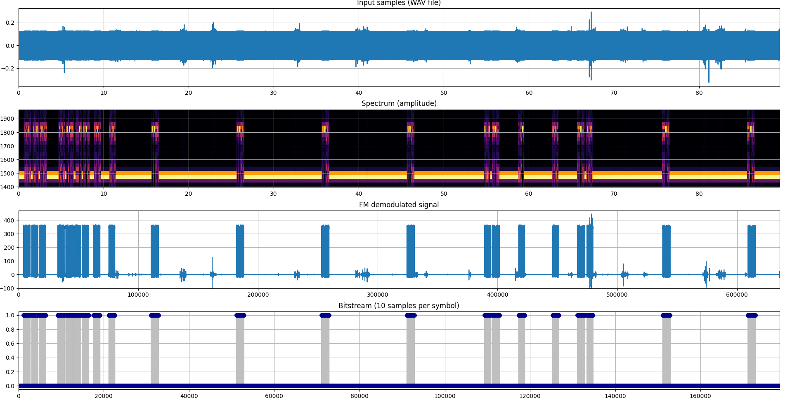

# DCF39 decoder

Just a simple Python script to investigate the complexity and performance
of DCF39 signal demodulation and decoding. Sample recordings in `resources`
directory are from [WebSDR](http://websdr.ewi.utwente.nl:8901/).
Here are some outputs of different stages of the demodulation and decoding
process:



The final output are the decoded telegrams:

```
telegram number: 2, A1: 0xA3, A2: 0xA3, user data: 0x60 0x10 0xF2 0x9D 0xCF, CRC: 0x3B
telegram number: 10, A1: 0xDF, A2: 0xB4, user data: 0x6F 0x80 0x80 0x88, CRC: 0x31
telegram number: 1, A1: 0xA3, A2: 0xA2, user data: 0x60 0x10 0xF2 0x9D 0xCF, CRC: 0x2A
telegram number: 2, A1: 0xA3, A2: 0xA3, user data: 0x60 0x10 0xF2 0x9D 0xCF, CRC: 0x3B
2025-4-16 (Wed) - 20:23:12 DST
telegram number: 10, A1: 0xDF, A2: 0xB4, user data: 0x6F 0x80 0x80 0x88, CRC: 0x31
telegram number: 1, A1: 0xA3, A2: 0xA2, user data: 0x60 0x10 0xF2 0x9D 0xCF, CRC: 0x2A
telegram number: 2, A1: 0xA3, A2: 0xA3, user data: 0x60 0x10 0xF2 0x9D 0xCF, CRC: 0x3B
telegram number: 10, A1: 0xDF, A2: 0xB4, user data: 0x6F 0x80 0x80 0x88, CRC: 0x31
2025-4-16 (Wed) - 20:23:22 DST
2025-4-16 (Wed) - 20:23:32 DST
2025-4-16 (Wed) - 20:23:42 DST
2025-4-16 (Wed) - 20:23:52 DST
telegram number: 10, A1: 0xB2, A2: 0xB8, user data: 0x6F 0x80 0x80 0x88, CRC: 0x08
2025-4-16 (Wed) - 20:24:2 DST
telegram number: 10, A1: 0xB2, A2: 0xB8, user data: 0x6F 0x80 0x80 0x88, CRC: 0x08
telegram number: 10, A1: 0xB2, A2: 0xB8, user data: 0x6F 0x80 0x80 0x88, CRC: 0x08
2025-4-16 (Wed) - 20:24:12 DST
telegram number: 10, A1: 0xB2, A2: 0xB8, user data: 0x6F 0x80 0x80 0x88, CRC: 0x08
2025-4-16 (Wed) - 20:24:22 DST
2025-4-16 (Wed) - 20:24:32 DST
```

## C version of the decoder

There is a C version of the decoder in the `c` directory. To build use the standard CMake
procedure:

```sh
cd c
mkdir build
cd build
cmake ..
make
```

Can be tested using sox:

```sh
sox ../../resources/c_sample.wav -t wav -c1 -r15000 - | ./dcf39_decoder
```

Needs specific format of the WAV files - 15k samplerate and 1kHz offset from the actual signal
(SSB tuned to 138kHz). `c_sample.wav` and `c_sample2.wav` are files recorded in this format.
